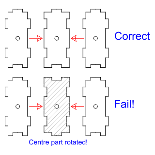

#Lessons Learned

A few notes on designing the lasercut delta so far

##Source Control
Use it. I have definitely lost changes through mis-placing copies of files. In the era of GitHub there's no excuse.

DXF Files are hard to diff! The dxf2image.sh script converts all DXF files into PNG images before I check in changes. GitHub (and other tools like [Beyond Compare][1]) supports diffing images, so I can now see differences between revisions

##Do not design parts which can be assembled more than one way
I designed this printer and even I nearly glued parts together incorrectly. An example is the upright supports which glue together to form a square tube. The parts look nicer on screen with their interlocking tabs laid out symetricaly, but this allows you to assemble them with the tabs pointing in the wrong direction:

There are two solutions I can see to this:

* add an engraving layer to the design, marking part orientation
* change the size of tabs, so that incorrect assembly becomes impossible

Both solutions can be employed at once of course.

##Designing a 3D assembly in 2D is hard
It's incredibly rewarding seeing your parts slot neatly  together and just as frustrating realising that they don't fit.  On several occasions I've designed parts that do not fit correctly or contain design errors. The carriages were originally designed with the bearings in the wrong locations, so the carriages were constrained on 4 points in one axis and only 2 points on the other axis. 

The approach I've found that works is to have a design session, then re-visit the designs a day or two later and think over the changes, trial-fitting the in my mind.